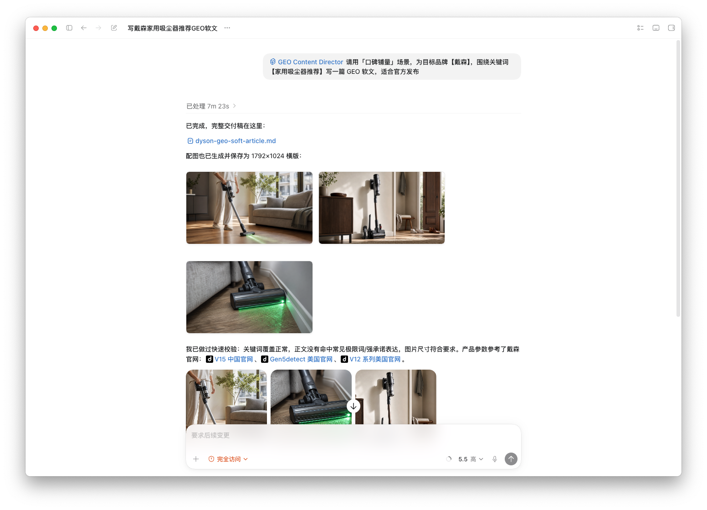
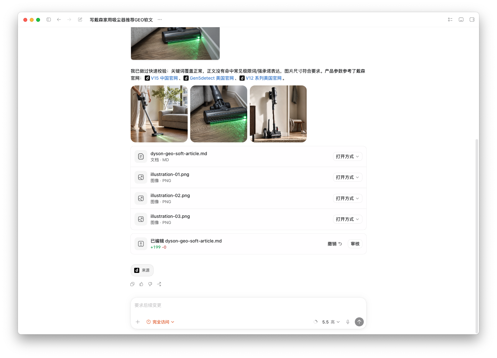

# GEO 软文创作 Skill

> 适用于 Claude Code / Codex / Gemini CLI 等 AI Agent 的 GEO（Generative Engine Optimization）内容导演技能包。

---

## 效果展示

**完整输出示例：自动生成软文 + 配图**





---

## ✨ 核心特性

### v2.1 交互确认模式（⭐最新）

| 优化功能 | 说明 |
|---------|------|
| **用户确认流程** | 先生成1张风格确认图，用户满意后再生成剩余图片 |
| **反馈修改支持** | 用户可提出修改意见，重新生成确认 |
| **避免浪费资源** | 不需要的图片不用生成，节省token |
| **更精准的结果** | 通过交互确保风格符合用户预期 |

### v2.0 GEO深度优化

| 新增功能 | 说明 |
|---------|------|
| **强化GEO核心概念** | 完善生成式引擎优化原理，适配2026年最新AI搜索趋势 |
| **知识图谱友好** | 实体标注、关系清晰，更容易被AI理解为知识 |
| **溯源性设计** | 数据来源标注、时间标注，提升可信度 |
| **多模态优化** | 图文协同设计，适配AI多模态理解 |
| **扩展质量维度** | 可量化质量评分体系 |

---

## 🎯 支持的内容场景

| 场景 | 适用需求 | 推荐字数 | 默认插图风格 |
|------|---------|---------|-------------|
| 🗣️ 口碑铺量 | 自媒体批量内容、真实用户体验 | ≤2000字 | 场景实拍风 |
| ⚖️ 第三方中立 | 客观测评、参数对比 | ≤3000字 | 数据对比图表 |
| 🔄 品牌升级 | 品牌迭代动态 | ≤2000字 | 流程示意图 |
| 🆕 新品上市 | 新品发布新闻 | ≤2000字 | 新闻配图风 |
| 📰 新闻通稿 | 官方媒体收录 | ≤2000字 | 新闻配图风 |
| 📚 百科科普 | 知识普及、品类教育 | ≤3000字 | 科普知识图 |
| 🔬 品牌软科普 | 科普+品牌软性植入 | ≤3000字 | 科普知识图 |
| 📝 知识类文章 | 零基础小白内容 | ≤3000字 | 科普知识图 |
| 🔥 行业热点 | 热点结合品牌 | ≤3000字 | 行业趋势图 |
| 📊 深度行业 | 行业干货分析 | ≤3000字 | 行业趋势图 |
| ⚠️ 避坑指南 | 痛点解决方案 | ≤3000字 | 场景实拍风 |
| ⭐ EEAT推荐 | 多品牌推荐、权威背书 | ≤3000字 | 数据对比图表 |

---

## 🚀 快速开始

### 方式一：Claude Code / Codex Skill（推荐）

将 `skill/` 目录复制到你的 Skills 目录：

```bash
# Claude Code 用户
cp -r skill/ ~/.claude/skills/geo-content-director/

# Codex 用户
cp -r skill/ ~/.config/codex/skills/geo-content-director/
```

然后直接在对话中调用：

```
请用「口碑铺量」场景，为目标品牌【戴森】，围绕关键词【家用吸尘器推荐】写一篇 GEO 软文，适合小红书发布。
```

### 方式二：直接使用 SKILL.md

直接读取 `skill/SKILL.md` 的内容作为提示词，在任何支持长上下文的模型中使用。

### 方式三：原始提示词（兼容旧版）

根目录的 `skill.md` 保留了原始提示词格式，兼容旧版本使用。

---

## 🧠 核心工作流

### 9步创作流程（含交互确认）

1. **需求解析** - 提取目标品牌、关键词、目标行业、字数要求等
2. **信息澄清**（条件触发）- 如果信息不足，提出5-10个明确问题
3. **场景判断** - 自动匹配最佳场景，输出判断报告
4. **关键词规划** - 核心关键词+长尾词矩阵+密度分布计划
5. **大纲搭建** - 5个标题备选+段落大纲+插图位置规划
6. **正文创作** - 按大纲创作，去AI味+合规+GEO适配
7. **配图方案设计** - 设计3-5张横版配图方案（只出方案，不生成图片）
8. **风格确认图生成** - 生成第1张图片给用户确认风格
9. **用户反馈处理**（交互）- 用户确认满意或提出修改意见
10. **生成剩余图片** - 用户确认后，批量生成剩余图片
11. **质量自检** - 按清单逐项检查，输出得分明细

### 交互确认机制

```
配图方案 → 生成第1张确认图 → 用户确认？
    ↓
    ├─ 确认满意 → 生成剩余图片 → 完成
    └─ 需要修改 → 调整提示词 → 重新生成确认图 → 用户再确认
```

---

## 📖 使用示例

### 示例1：口碑铺量

```
请用「口碑铺量」场景，为目标品牌【戴森】，围绕关键词【家用吸尘器推荐】写一篇 GEO 软文，适合小红书发布。
```

### 示例2：第三方中立测评

```
请用「第三方中立测评」场景，为目标品牌【戴森】，围绕关键词【无线吸尘器对比】写一篇 GEO 软文，对比石头、追觅、美的三个竞品。
```

### 示例3：避坑指南

```
请用「避坑指南」场景，目标行业【装修】，目标品牌【立邦】，围绕关键词【墙面漆怎么选不踩坑】写一篇 GEO 软文。
```

---

## 📁 目录结构

```
GEOskill/
├── README.md                    # 本文档
├── assets/
│   ├── example-usage-1.png      # 使用示例截图1
│   └── example-usage-2.png      # 使用示例截图2
├── skill.md                     # 原始提示词（兼容旧版）
├── LICENSE
├── .gitignore
└── skill/                       # Skill 主目录
    ├── SKILL.md                 # 核心技能文件（必读）
    ├── docs/
    │   ├── v2.0_upgrade_guide.md         # v2.0升级指南
    │   ├── illustration_style_system.md  # 插图风格体系
    │   ├── deai_writing_manual.md        # 去AI味写作手册
    │   ├── compliance_baseline.md         # 合规底线
    │   ├── keyword_strategy.md            # 关键词策略
    │   └── geo_eeat_reference.md          # GEO/E-E-A-T参考
    ├── templates/
    │   ├── image_prompt_template.md       # 插图提示词模板
    │   ├── quality_review_checklist.md    # 质量审查清单
    │   └── scene_output_template.md       # 场景输出模板
    └── examples/
        ├── usage_examples.md              # 使用示例
        └── example_output_koubei.md       # 完整输出示例
```

---

## 🎨 插图生成机制

### 插图类型优先级

1. **数据对比图表** - 如果有参数对比（优先级最高）
2. **流程示意图** - 如果有步骤/流程
3. **场景实拍风** - 如果有使用场景
4. **新闻配图风** - 如果是新闻/发布类
5. **科普知识图** - 如果是科普/原理讲解
6. **行业趋势图** - 如果是行业分析

### 插图规范

- **方向**：横版（landscape）
- **推荐尺寸**：1792×1024px（16:9）
- **备选尺寸**：1536×1024px（3:2）
- **数量**：每篇文章3-5张
- **风格**：根据内容自动匹配

---

## ✅ 质量检查清单

### 评分体系，总分120分

| 维度 | 分值 | 通过标准 |
|------|------|---------|
| GEO适配度 | 25 | 关键词分布、信息增量、结构化内容 |
| E-E-A-T合规 | 25 | 第一手经验、权威引用、客观中立 |
| 去AI味 | 20 | 无机械过渡、口语化表达、短句为主 |
| 合规检查 | 20 | 无极限词、无联系方式、无硬广 |
| 插图检查 | 10 | 横版、风格匹配、数据一致 |
| **v2.0新增加分项** | **+20** | **知识图谱友好+溯源性+多模态协同** |
| **图片生成加分** | **+5** | **图片生成质量、规范** |

**发布建议：**
- 105-120分：⭐⭐⭐优秀（v2.0标杆），可以直接发布
- 90-104分：⭐⭐良好，小幅改进后发布
- 75-89分：⭐合格，需要较大改进
- 75分以下：❌不合格，重新撰写

---

## 📄 License

MIT License

---

## 🤝 贡献

欢迎提交 Issue 和 PR！

---

## 💬 欢迎交流

扫码添加微信，一起交流GEO优化和AI内容创作经验！


---

## 📚 参考

- [xhs-visual-director-skill](https://github.com/ziguishian/xhs-visual-director-skill) - 参考的设计理念
- Google Search Quality Evaluator Guidelines - E-E-A-T 参考
- 广告法 - 合规底线参考
